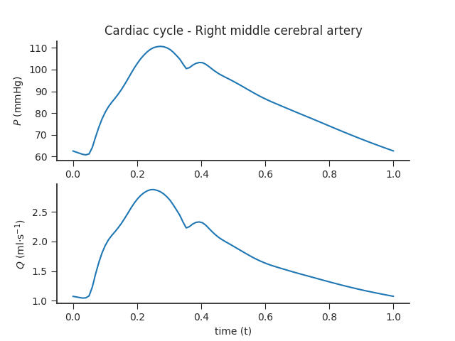
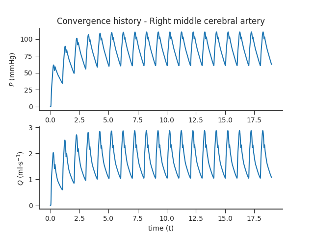

# Circle of Willis

_Alastruey J, Parker KH, Peiró J, Byrd SM, Sherwin SJ. [Modelling the circle of Willis to assess the effects of anatomical variations and occlusions on cerebral flows](http://www.sciencedirect.com/science/article/pii/S0021929006002946). Journal of biomechanics. 2007 Dec 31;40(8):1794-805_

---

