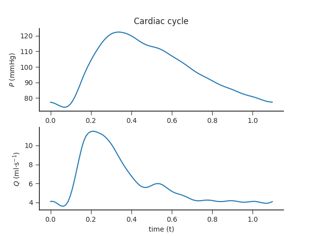
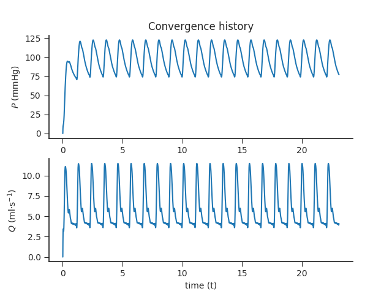

# ADAN56

_Blanco PJ, Watanabe SM, Passos MA, Lemos PA, Feijóo RA. An anatomically detailed arterial network model for one-dimensional computational hemodynamics. IEEE Transactions on biomedical engineering. 2015 Feb;62(2):736-53._

---

