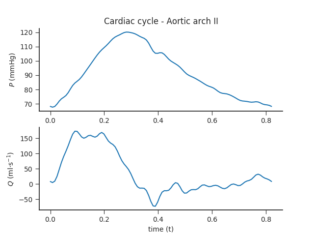

In vitro human arterial network

_Matthys KS, Alastruey J, Peiró J, Khir AW, Segers P, Verdonck PR, Parker KH, Sherwin SJ. Pulse wave propagation in a model human arterial network: assessment of 1-D numerical simulations against in vitro measurements. Journal of biomechanics. 2007 Dec 31;40(15):3476-86._

---

